# Comad CAR 시스템 사용자 플로우 맵

> 최종 수정일: 2026-03-19
> 작성자: 김정현
> 업데이트: **전체 기능 구현 완료 기준 최종본** + Date Score, UI 통일, 다국어 지원 플로우 추가, Score Worst 5 필터링 강화 (2025-07-02), Risk Mitigation 플로우 확장, cookie 기반 언어 저장 (2026-02-11), **v2.4.3 보고서 생성 자동화 (n8n 기반) 플로우 변경** (2026-03-19)

---

## 1. 전체 사용자 플로우 개요

Comad CAR 시스템은 로그인 → 대시보드 → 상세 기능 순으로 진행되는 직관적인 사용자 경험을 제공합니다. **2025-07-02 기준으로 Date Score 시스템, 통일된 UI, 완전한 다국어 지원이 모든 플로우에 완전히 통합되었습니다.**

### 주요 플로우 특징
- **권한 기반**: 사용자 역할에 따른 동적 메뉴 및 기능
- **Date Score 통합**: CONTINUOUS 이벤트의 시간 관리 정보 자동 표시
- **UI 일관성**: 모든 상세 화면에서 동일한 레이아웃 패턴
- **다국어 지원**: 6개 언어 실시간 전환 지원
- **반응형**: 모든 디바이스에서 최적화된 사용자 경험

---

## 2. 다국어 지원 플로우 (2025-07-02 신규 추가)

```mermaid
graph TD
    A[시스템 접속] --> B{저장된 언어 설정?}
    B -->|있음| C[저장된 언어 적용]
    B -->|없음| D[브라우저 언어 감지]
    D --> E[지원 언어 확인]
    E -->|지원됨| F[해당 언어 적용]
    E -->|미지원| G[영어(en) 기본 적용]
    F --> H[언어별 UI 렌더링]
    G --> H
    C --> H
    H --> I[언어 스위처 표시]
    I --> J{언어 변경 요청?}
    J -->|예| K[새 언어 선택]
    K --> L[NEXT_LOCALE cookie 저장]
    L --> M[페이지 새로고침]
    M --> H
    J -->|아니오| N[현재 언어 유지]
```

### 다국어 지원 특징
- **6개 언어**: ko, en, es-mx, hi, vi, zh
- **실시간 전환**: 언어 변경 시 즉시 적용
- **기본 언어**: 한국어(ko) 기본, 영어(en) fallback
- **저장 방식**: NEXT_LOCALE cookie 기반 설정 유지
- **UI 최적화**: 언어별 텍스트 길이 차이 대응

---

## 3. 로그인 및 초기 진입 플로우

```mermaid
graph TD
    A[시스템 접속] --> B{로그인 상태?}
    B -->|아니오| C[/login 페이지]
    B -->|예| D[/dashboard 페이지]
    C --> E[ID/PW 입력]
    E --> F{인증 성공?}
    F -->|실패| G[다국어 오류 메시지]
    G --> E
    F -->|성공| H[JWT 토큰 발급]
    H --> I[sessionStorage 저장]
    I --> D
    D --> J[역할별 메뉴 표시]
    J --> K[언어별 대시보드 로딩]
```

### 권한별 초기 화면
- **ADMIN**: 모든 메뉴 활성화 + 사용자 관리 버튼 (다국어)
- **MANAGER**: 사용자 관리 제외한 모든 메뉴 (다국어)
- **STAFF**: 기본 메뉴 + 제한된 수정/삭제 권한 (다국어)

---

## 4. **Date Score 통합 플로우**

### 4.1 CAR 조회 시 Date Score 표시
```mermaid
graph TD
    A[CAR 조회 요청] --> B{Event Type?}
    B -->|ONE_TIME| C[주관적 점수만 표시]
    B -->|CONTINUOUS| D[Date Score 계산]
    B -->|기타| E[모든 점수 표시]
    D --> F{기한일 & 완료일 존재?}
    F -->|예| G[지연 일수 계산]
    F -->|아니오| H[Date Score: null]
    G --> I[점수 계산 (-5~+5)]
    I --> J[3열 그리드 표시]
    C --> K[1열 그리드 표시]
    E --> L[4열 그리드 표시]
    H --> J
    J --> M[통일된 레이아웃 렌더링]
    K --> M
    L --> M
```

### 4.2 Event Type별 사용자 경험
- **ONE_TIME**: 간소화된 점수 정보로 빠른 파악
- **CONTINUOUS**: Date Score 중심의 시간 관리 정보 강조
- **기타**: 모든 정보 제공으로 종합적 판단 지원

---

## 5. CAR 관리 플로우

### 5.1 CAR 등록 플로우
```mermaid
graph TD
    A[CAR 등록 버튼] --> B[/car/new 페이지]
    B --> C[폼 필드 표시]
    C --> D[고객 담당자 드롭다운]
    D --> E{Event Type 선택}
    E -->|CONTINUOUS| F[기한일 필드 활성화]
    E -->|ONE_TIME| G[주관적 점수 필드 강조]
    E -->|기타| H[모든 점수 필드 표시]
    F --> I[폼 입력 완료]
    G --> I
    H --> I
    I --> J[유효성 검증]
    J -->|실패| K[오류 메시지 표시]
    J -->|성공| L[API 저장 요청]
    K --> I
    L --> M[데이터베이스 저장]
    M --> N[목록 페이지 리다이렉트]
    N --> O[새 CAR 표시]
```

### 5.2 **통일된 CAR 상세 조회 플로우**
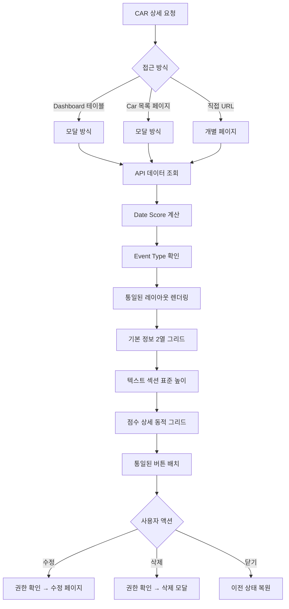

---

## 6. AI 분석 및 보고서 플로우

### 6.1 AI 전략 제언 플로우

> **v2.4.3 변경사항**: AI 분석이 n8n 워크플로우로 이관되어, 프론트엔드에서 직접 AI 분석을 트리거하지 않습니다. 보고서 데이터는 n8n이 사전 생성하여 DB에 저장하며, 프론트엔드는 DB 조회만 수행합니다.

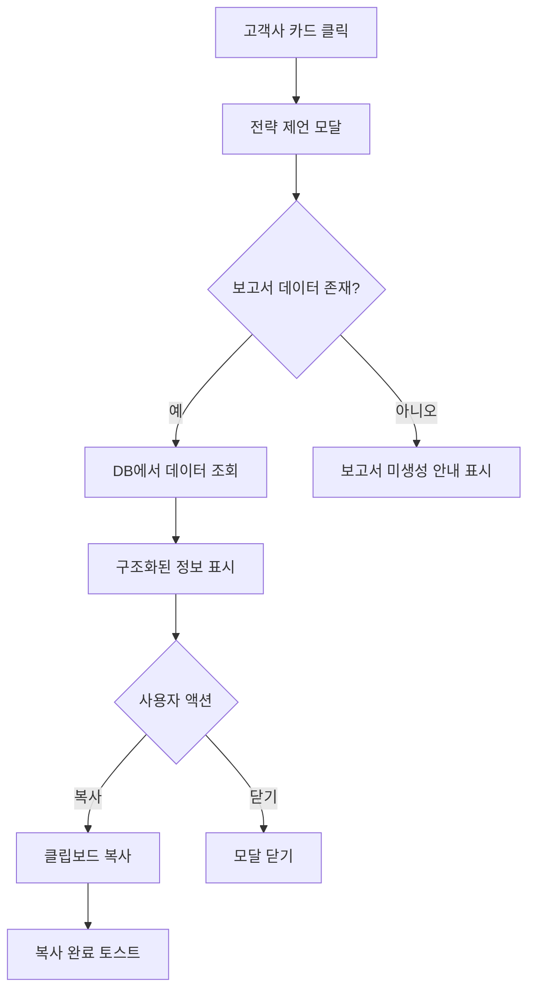

### 6.2 자동 보고서 생성 플로우 (v2.4.3 변경)

> **v2.4.3 변경사항**: 보고서 생성이 프론트엔드 수동 방식에서 n8n 스케줄 기반 자동화로 전환되었습니다. 프론트엔드에서 보고서 생성 버튼이 제거되었으며, 사용자는 생성된 보고서를 조회만 합니다.

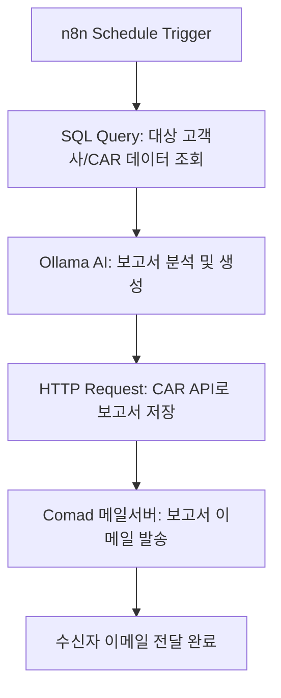

### 6.3 보고서 조회 플로우 (v2.4.3)
```mermaid
graph TD
    A[사용자] --> B[/admin/report 페이지 접근]
    B --> C[보고서 목록 조회]
    C --> D[보고서 선택]
    D --> E[보고서 상세 보기]
```

---

## 7. **UI 통일성 보장 플로우**

### 7.1 모달 렌더링 통일 플로우
```mermaid
graph TD
    A[상세 정보 요청] --> B[공통 모달 컴포넌트]
    B --> C[기본 정보 섹션]
    C --> D[2열 그리드 레이아웃]
    D --> E[법인|고객사, 담당자|부서...]
    E --> F[텍스트 섹션]
    F --> G[주제 40px, Issue 80px, Plan 80px]
    G --> H[점수 섹션]
    H --> I{Event Type 분기}
    I -->|ONE_TIME| J[1열 그리드]
    I -->|CONTINUOUS| K[3열 그리드]
    I -->|기타| L[4열 그리드]
    J --> M[버튼 섹션]
    K --> M
    L --> M
    M --> N[닫기|수정|삭제 버튼]
    N --> O[통일된 색상 스킴]
```

### 7.2 반응형 적응 플로우
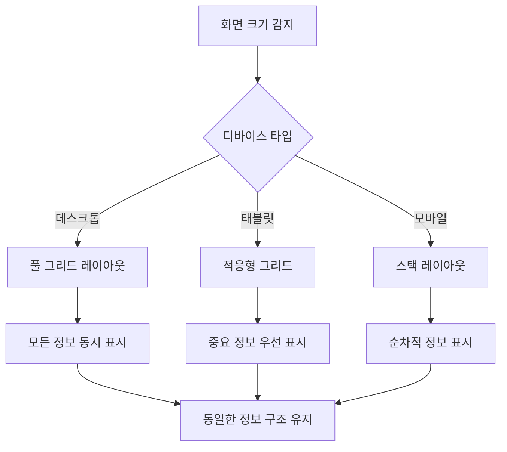

---

## 8. 오류 처리 및 예외 플로우

### 8.1 네트워크 오류 플로우
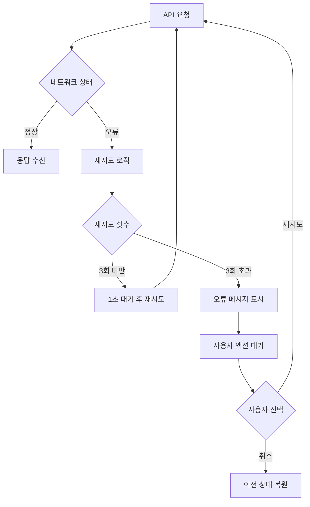

### 8.2 권한 오류 플로우
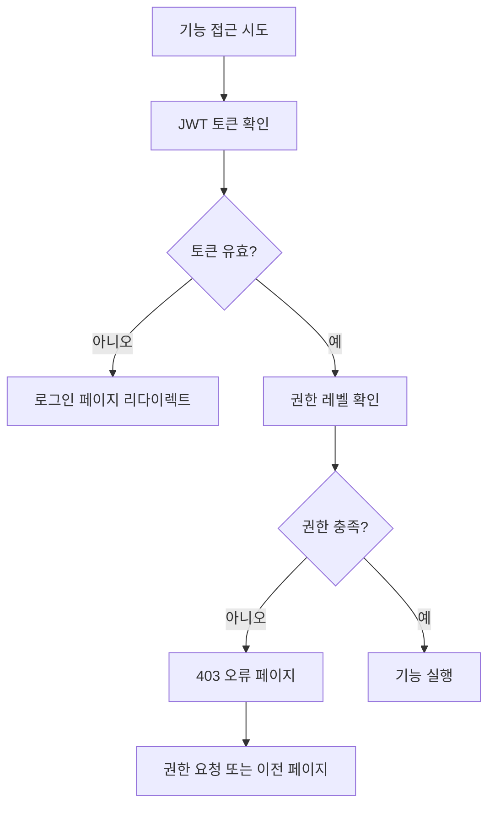

---

## 9. **성능 최적화 플로우**

### 9.1 Date Score 캐싱 플로우
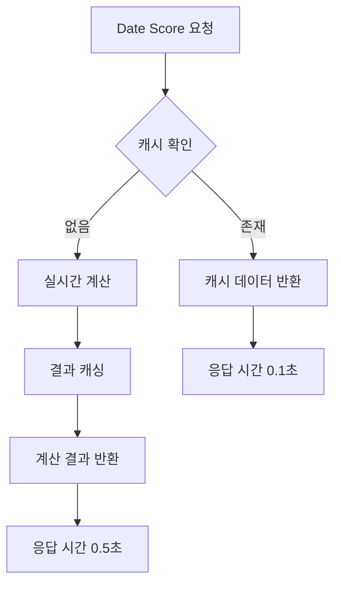

### 9.2 UI 렌더링 최적화 플로우
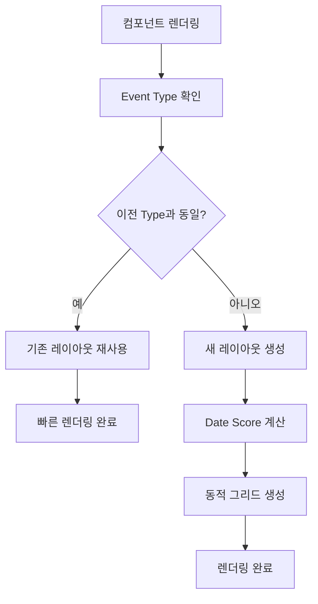

---

## 10. 글로벌(i18n) 언어 흐름 플로우

### 10.1 언어 선택 및 반영 흐름

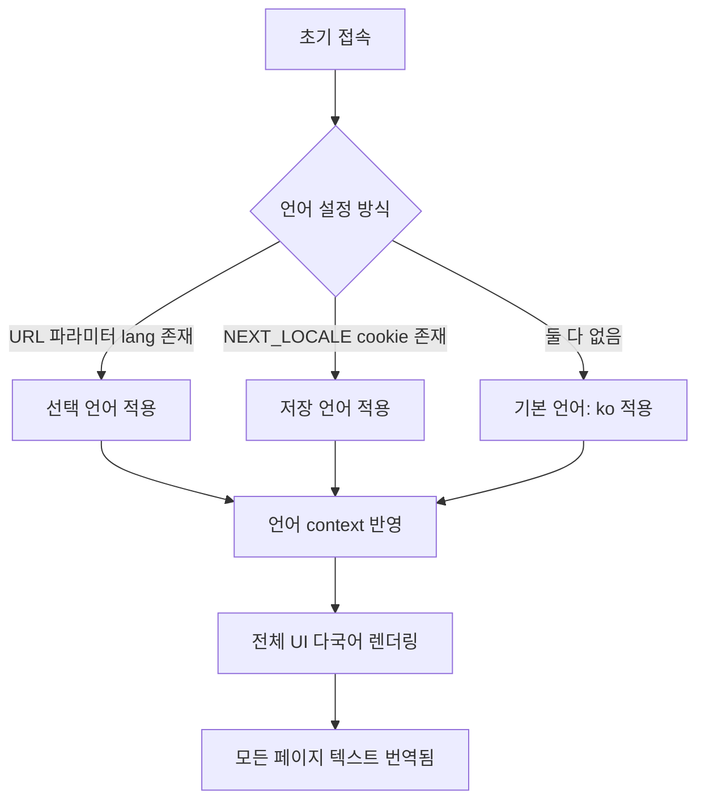

### 10.2 언어 스위치 UI 흐름
```mermaid
graph TD
    A[사용자 네비게이션 상단 접근] --> B[🌐 언어 드롭다운 클릭]
    B --> C[언어 선택 (예: 영어)]
    C --> D[NEXT_LOCALE cookie = "en"]
    D --> E[언어 context 업데이트]
    E --> F[전체 페이지 리렌더링]
    F --> G[선택 언어 기반 텍스트 출력]
```

### 10.3 페이지 전환 시 언어 유지
- 언어 변경은 전역 상태(i18n context + NEXT_LOCALE cookie)로 관리됨
- 페이지 이동 시에도 언어 유지 (ex: Dashboard → /car 상세)
- 새로고침/재접속 시에도 언어 설정 유지됨

---

## 11. Risk Mitigation 관리 플로우 (v2.4.2 확장, v2.4.3 유지)

### 11.1 Risk Mitigation 등록/수정 플로우
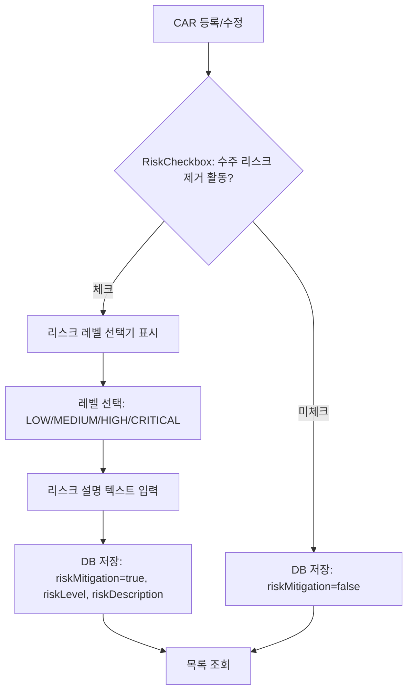

### 11.2 Risk Indicator 표시 플로우
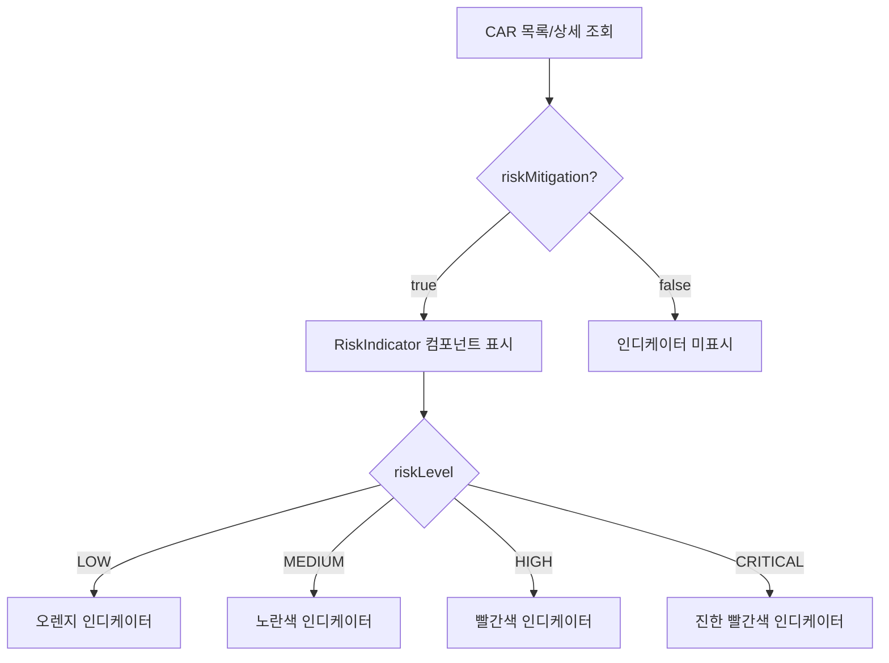

### 11.3 Risk Dashboard 조회 플로우
```mermaid
graph TD
  A[네비게이션: Risk Dashboard 클릭] --> B[/dashboard/risk 페이지]
  B --> C[riskMitigation=true인 CAR 데이터 필터]
  C --> D[스코어보드 테이블 렌더링]
  D --> E[법인별/카테고리별 매트릭스]
  C --> F[Gantt 차트 렌더링]
  F --> G[타임라인 ±6개월]
  F --> H[진행률 바: 초록/노랑/빨강]
  E --> I[법인 섹션 접기/펼치기]
  H --> J[CAR 클릭 → 상세 모달]
```